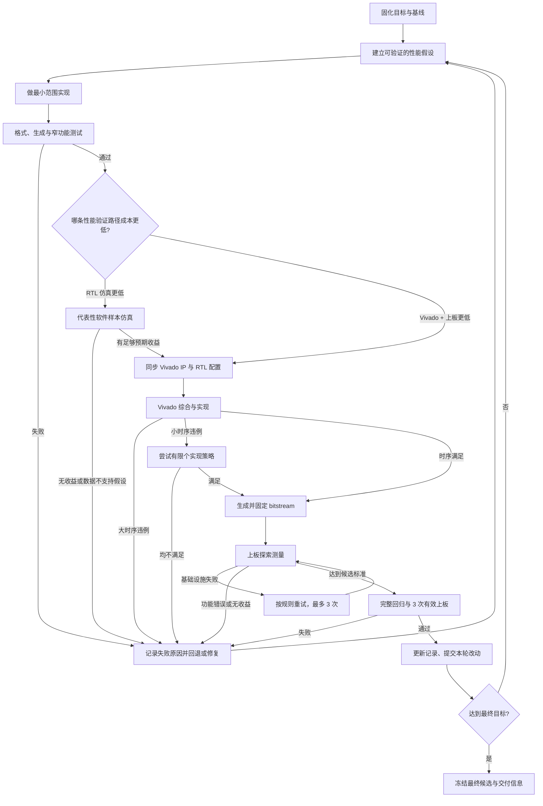

# CPU 性能优化迭代流程

本文描述顺序单发射 CPU 的通用性能优化闭环，用于指导后续迭代。它关注实验设计、验证门禁、时序处理、上板测量和记录方式，不规定具体优化方向。

## 总体流程



## 1. 固化目标和实验边界

开始优化前写清以下内容，并在整轮迭代中保持不变：

- 架构约束，例如顺序单发射不得改变。
- 最低频率和优选频率；降频只有在总运行时间确实改善时才可接受。
- 性能目标及统计口径，例如三次有效上板结果的中位数。
- 正确结果的判定方式，包括显示值、LED 或测试通过数。
- 固定软件、COE、Vivado 工程、器件、时钟约束和测试命令。
- 最终候选必须满足的时序条件。探索阶段的负 WNS 不等于可以验收。

基线至少记录：

- RTL 与 Vivado 仓库 commit、dirty 状态。
- COE 或输入镜像的 SHA-256。
- 目标频率、实现策略、WNS/TNS/WHS。
- 一次正确上板结果及对应 bitstream 哈希。
- 动态指令数、运行周期、CPI，以及已有的 stall、flush、预测等性能计数。

没有可重复基线时，不进入优化实现。

## 2. 建立一次只回答一个问题的实验

每个实验先写假设，再改代码。实验说明应包含：

- 要减少的周期来源或关键路径。
- 数据依据，以及样本是否足够代表真实负载。
- 预期收益的数量级和继续推进阈值。
- 可能影响的功能路径、时序路径和所需专项测试。
- 明确的保留、回退条件。

优先使用性能计数器和主样例数据定位瓶颈。小型 CPU 测试主要用于功能验证，不应单独用于推断整体性能。需要一个耗时适中、比单元测试更有代表性的样本时，可使用：

```sh
make -C am-kernels/benchmarks/microbench ARCH=riscv32-jyd run mainargs=train
```

如果该样本与真实上板负载差异明显，不应拿它替代真实负载。此时根据成本选择直接上板测量，或运行固定主样例的 RTL perf 获取诊断数据。

## 3. 最小实现和快速功能门禁

一次只实现足以验证假设的最小改动，避免同时混入多个无法独立归因的优化。

先执行快速门禁：

```sh
make -C npc reformat
make -C npc checkformat
make -C npc verilog
make -C am-kernels/tests/cpu-tests run ARCH=riscv32-jyd ALL=add
```

然后按改动范围补充专项测试：

- 访存相关：`load-store`。
- 控制流相关：`switch`、`if-else`、`recursion`。
- M 扩展相关：`mul`、`mulh`、`mulhu`、`mulhsu` 定向架构测试。
- CSR 相关：必须运行 `rt-thread`，到达 `msh />` 视为成功。
- JYD 专用路径：必须使用 `ARCH=riscv32-jyd`。

任何功能失败都先修复或回退，不进入 Vivado。失败实验也要记录。

## 4. 按成本选择性能验证路径

不要固定要求“完整 RTL 仿真后才能上板”。每批样例开始前，分别估算：

- RTL 仿真完成真实负载所需时间。
- Vivado 综合、实现、生成 bitstream 加一次上板所需时间。
- 是否已经有可复用的综合结果或只需重跑 implementation。
- 是否需要仿真性能计数器来定位瓶颈，而不只是判断快慢。

本次迭代的上板样例执行很短，因此完整仿真仍有筛选和诊断价值。但对之后的大部分长样例，**Vivado + 上板通常远低于完整 RTL 仿真的成本**。这类样例通过快速功能门禁后，应优先进入 Vivado 时序检查和一次探索上板；不必为了遵守流程先跑完整主样例仿真。

建议按以下规则选择：

- 若完整仿真明显更快，或预期大量候选会在周期收益上失败：先仿真筛选。
- 若 Vivado + 上板更快：先实现并上板，用真实运行时间筛选。
- 若优化是否有效可以从短小但有代表性的仿真片段判断：用片段筛选，不必跑完整负载。
- 若上板显示无收益但原因不清楚，或需要区分 stall、flush、访存和预测来源：再运行 RTL perf 做诊断。
- 若改动涉及难以上板观察的内部协议、偶发数据相关或缓存一致性：即使耗时更长，也应补充针对性仿真。

因此，RTL perf 是性能定位和解释工具，不是每次上板前的强制门禁。无论选择哪条路径，都要回答：优化是否确实减少真实负载时间，以及收益是否足以覆盖时序或复杂度代价。

需要 RTL perf 时，固定主样例可用轻量模式运行，示例：

```sh
env MAKE_PERF=1 make -C npc sim \
  IMG=../jyd-tests/2026/bin/withMext-v2.bin \
  ARGS=-b VSIM_difftest=0 VSIM_showdisasm=0 VSIM_etrace=0
```

比较时至少查看：

- 总周期、动态指令数、CPI。
- 各流水级 backpressure、bubble、fire。
- RAW conflict 与真实 stall，并区分 EXU/LSU/WBU 来源。
- flush 次数及原因。
- 分支类型、动态次数、误判数和准确率。

执行过 RTL perf 时，性能计数必须与上板时间能互相解释。若仿真周期按目标频率换算后与上板明显不一致，先检查输入镜像、频率、仿真模型和 IP 延迟是否一致。

## 5. 保证 RTL、仿真模型和 Vivado IP 一致

涉及 Vivado IP 时，必须同时核对：

- Chisel/RTL 的握手和延迟参数。
- inline 仿真模型的延迟与接口行为。
- Vivado `.xci` 配置及生成的 `C_LATENCY` 等参数。
- OOC IP synthesis checkpoint 是否已重新生成。
- `pack-fpga` 是否正确排除 inline 模型并绑定 Vivado IP。

IP 改动后若顶层综合提示找不到模块或仍使用旧参数，先重建对应 OOC IP，再运行顶层综合。不要用 RTL 与 IP 延迟不一致的 bitstream 做性能判断。

## 6. Vivado 时序门禁

生成实现结果：

```sh
./npc/scripts/run_digital_twin_vivado.sh bitstream --jobs 32
```

检查 routed timing：

```sh
cd "$JYD_VIVADO_PROJ_HOME"
python3 scripts/extract-wns-violations.py -n 3
python3 scripts/extract-timing-summary.py \
  ./digital_twin.runs/impl_1/top_timing_summary_routed.rpt
```

处理规则：

- 约束解析或对象选择错误是硬失败，先修复 XDC。
- 大时序违例说明结构有问题，应停止布线尝试并优化设计。
- 小时序违例可尝试少量预先选定的 implementation 策略。
- 多个策略仍不满足时，不继续随机扫描策略，回到结构优化。
- 负 WNS bitstream 最多用于规则允许的探索测量；最终候选必须 `WNS >= 0`，并同时检查 TNS 和保持时间。

每次记录最差路径的 source、destination、逻辑级数、logic/route delay 比例。这能区分逻辑过深、扇出过大和布局布线问题。

## 7. 上板测量和重试规则

上板命令必须直接执行，不增加 shell 包装：

```sh
.venv/bin/python3 -m jyd_client.cli run --skip-login /path/to/candidate.bit
```

测量分为两个阶段：

### 探索测量

- 用一次有效结果判断收益方向。
- 快速功能测试和可接受的探索时序条件必须满足；代表性仿真只在所选成本路径或风险分析要求时执行。
- 无收益时立即停止，不为同一无收益候选重复烧录。

### 最终确认

- 固定同一个 bitstream，不在三次测量之间重新实现。
- 获得三次正确、有效的结果，并计算中位数。
- 保存 bitstream SHA-256、频率、实现策略和 routed timing 报告。

以下属于基础设施失败，可重试，最多三次：

- JTAG target 被其他 hw_server 锁定。
- 网络、上传、烧录或串口采样异常。
- 烧录成功但串口没有形成稳定有效结果。

功能结果错误、稳定但性能不达标，不属于基础设施失败，不应靠重复测量掩盖。

## 8. 最终回归门禁

候选达到性能目标后，至少执行：

```sh
make -C npc checkformat
make -C npc verilog
make -C npc verilog-lint

make -C am-kernels/tests/cpu-tests run ARCH=riscv32-jyd ALL=add
make -C am-kernels/tests/cpu-tests run ARCH=riscv32-jyd ALL=load-store
make -C am-kernels/tests/cpu-tests run ARCH=riscv32-jyd ALL=switch
make -C am-kernels/tests/cpu-tests run ARCH=riscv32-jyd ALL=if-else
make -C am-kernels/tests/cpu-tests run ARCH=riscv32-jyd ALL=recursion
```

根据改动范围执行 AGENTS.md 要求的专项回归。`verilog-lint` 的已知 `PINCONNECTEMPTY` 可单独记录；出现其他 warning/error 时不能直接忽略。

## 9. 实验记录模板

每个尝试都追加到优化记录，不删除失败项：

```text
实验编号 / 标题：
日期 / 状态：
假设和数据依据：
预期收益与继续阈值：
RTL commit / dirty diff hash：
Vivado commit / IP 配置 / implementation 策略：
输入镜像或 COE SHA-256：
改动摘要：
快速功能测试：
代表性仿真：周期、CPI、关键计数器：
时序：频率、WNS、TNS、WHS、最差路径：
bitstream SHA-256：
上板有效结果及中位数：
基础设施失败和重试：
结论：保留 / 回退 / 待复查：
依据与下一步：
```

原始 Vivado、仿真和上板日志可放在生成目录或外部归档；版本库中的记录文档保存摘要、哈希和可复现命令。

## 10. 提交规则

只有满足该轮定义的功能、时序和性能门禁后才提交。提交前：

- `git diff --check`。
- 核对 staged 文件，避免混入用户已有的无关修改和生成物。
- RTL 与独立 Vivado 工程的必要 IP 配置要分别保存；不要只提交一侧。
- 提交信息描述可观察结果，而不是实验过程。
- 在记录中写入最终 commit、bitstream 哈希和验证命令。

## 快速决策表

| 观察结果 | 决策 |
| --- | --- |
| 窄功能测试失败 | 修复或回退，不跑 Vivado |
| 完整 RTL 仿真远慢于 Vivado + 上板 | 快速功能门禁后优先实现和探索上板 |
| 需要定位周期损失来源 | 运行 RTL perf 并查看 stall、flush 等计数器 |
| 小样本改善，主样例无改善 | 以主样例为准，回退或重新定位 |
| 主样例收益小于继续阈值 | 记录并停止该实验 |
| 大时序违例 | 优化结构，不扫描实现策略 |
| 小时序违例 | 尝试有限个策略 |
| 所有策略仍为负 WNS | 回到设计，不作为最终候选 |
| 上板基础设施失败 | 最多重试三次 |
| 上板功能正确但无收益 | 回退，不重复测量 |
| 性能达标但最终时序或回归失败 | 不能提交为最终候选 |
| 三次有效上板、时序和回归均通过 | 更新记录并提交 |
