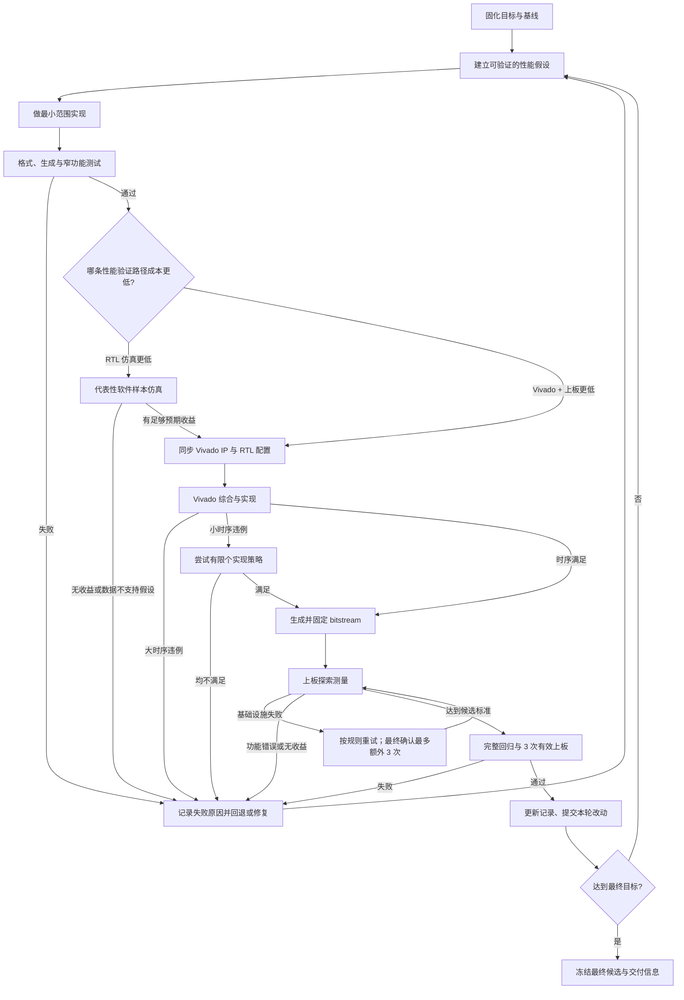

# CPU 性能优化迭代流程

本文描述顺序单发射 CPU 的通用性能优化闭环，用于指导后续迭代。它关注实验设计、验证门禁、时序处理、上板测量和记录方式，不规定具体优化方向。

本流程不是只在迭代开始时阅读一次的背景材料。主代理在提出假设、分派任务、选择验证路径、处理时序结果以及决定保留或回退候选时，都必须持续对照本文相应章节；若实际情况需要偏离流程，应先在当轮优化记录中写明原因和替代门禁，不能静默跳过。

## 代理协作约定

优化实现、故障修复、代码审阅、性能数据分析、Vivado 策略/IP 工作和专项验证等边界清晰的任务，建议交给 subagent 并行完成，不要求主代理亲自修改全部代码。主代理负责把每项委派限定为可独立验收的任务，并明确允许修改的文件、输入基线、预期产物和验证命令。

所有代理共享同一工作树，因此协作时必须遵守以下规则：

- 分派前检查已有代理及工作树状态，尽量按文件或模块划分任务，避免多个代理同时修改同一文件。
- 确需触碰相同文件时，由主代理明确串行顺序；后执行者必须先重新读取当前内容，不得用旧上下文覆盖其他代理的改动。
- subagent 不自行提交，除非主代理明确授权；不得回退、清理或改写用户及其他代理的现有修改。
- 主代理持续收集各代理的假设、改动范围、测试结果和未解决风险，不能只根据“任务完成”的状态直接合并结论。
- 并行任务结束后，由主代理统一检查 diff、解决交叉影响，并在共享工作树上执行与候选改动范围相匹配的集成验证。subagent 的局部测试不能代替最终集成门禁。
- 每轮记录应注明关键任务的负责人或代理、实际修改范围及验证结果，使并行工作仍可追溯。

## 总体流程



## 1. 固化目标和实验边界

开始优化前写清以下内容，并在整轮迭代中保持不变：

- 架构约束，例如顺序单发射不得改变。
- 最低频率和优选频率；降频只有在总运行时间确实改善时才可接受。
- 性能目标及验收口径；三次有效上板用于确认同一正式产物稳定一致，不用中位数吸收异常。
- 正确结果的判定方式，包括显示值、LED 或测试通过数。
- 固定软件、COE、Vivado 工程、器件、时钟约束和测试命令。
- 最终候选必须满足的时序条件。探索阶段的负 WNS 不等于可以验收。

当前 `withMext-v2` 迭代的硬目标是同一正式 bitstream 的三次有效上板功能、周期和显示时间完全一致，且该共同结果不超过 1.75 s，冲刺目标为 1.70 s；真实动态指令数为 380,344,412。目标值和指令数应作为实验参数记录，不能隐含在脚本逻辑中。

基线至少记录：

- RTL 与 Vivado 仓库 commit、dirty 状态。
- Vivado 完整版本，以及 run 名、strategy 和各实现步骤实际执行的 directive；不能只记录策略显示名。
- Vivado 解析后的综合源文件清单及其 SHA-256，确认所有项目输入都位于预期仓库或明确记录的外部目录。
- COE 或输入镜像的 SHA-256。
- 目标频率、实现策略、WNS/TNS/WHS。
- `synth_1` DCP、routed DCP、时序报告和 bitstream 的 SHA-256；若产物太大不入库，必须保存到明确的归档位置。
- 一次正确上板结果及对应 bitstream 哈希。
- 动态指令数、运行周期、CPI，以及已有的 stall、flush、预测等性能计数。

没有可重复基线时，不进入优化实现。

## 2. 建立一次只回答一个问题的实验

每个实验先写假设，再改代码。实验说明应包含：

- 要减少的周期来源或关键路径。
- 数据依据，以及样本是否足够代表真实负载。
- 预期收益的数量级和继续推进阈值。
- 可能影响的功能路径、时序路径和所需专项测试。
- 明确的保留、回退条件。

优先使用性能计数器和主样例数据定位瓶颈。小型 CPU 测试主要用于功能验证，不应单独用于推断整体性能。需要一个耗时适中、比单元测试更有代表性的样本时，可使用：

```sh
make -C am-kernels/benchmarks/microbench ARCH=riscv32-jyd run mainargs=train
```

如果该样本与真实上板负载差异明显，不应拿它替代真实负载。此时根据成本选择直接上板测量，或运行固定主样例的 RTL perf 获取诊断数据。

## 3. 最小实现和快速功能门禁

一次只实现足以验证假设的最小改动，避免同时混入多个无法独立归因的优化。

先执行快速门禁：

```sh
make -C npc reformat
make -C npc checkformat
make -C npc verilog
make -C am-kernels/tests/cpu-tests run ARCH=riscv32-jyd ALL=add
```

然后按改动范围补充专项测试：

- 访存相关：`load-store`。
- 控制流相关：`switch`、`if-else`、`recursion`。
- M 扩展相关：`mul`、`mulh`、`mulhu`、`mulhsu` 定向架构测试。
- CSR 相关：必须运行 `rt-thread`，到达 `msh />` 视为成功。
- JYD 专用路径：必须使用 `ARCH=riscv32-jyd`。

任何功能失败都先修复或回退，不进入 Vivado。失败实验也要记录。

## 4. 按成本选择性能验证路径

不要固定要求“完整 RTL 仿真后才能上板”。每批样例开始前，分别估算：

- RTL 仿真完成真实负载所需时间。
- Vivado 综合、实现、生成 bitstream 加一次上板所需时间。
- 是否已经有可复用的综合结果或只需重跑 implementation。
- 是否需要仿真性能计数器来定位瓶颈，而不只是判断快慢。

本次迭代的上板样例执行很短，因此完整仿真仍有筛选和诊断价值。但对之后的大部分长样例，**Vivado + 上板通常远低于完整 RTL 仿真的成本**。这类样例通过快速功能门禁后，应优先进入 Vivado 时序检查和一次探索上板；不必为了遵守流程先跑完整主样例仿真。

建议按以下规则选择：

- 若完整仿真明显更快，或预期大量候选会在周期收益上失败：先仿真筛选。
- 若 Vivado + 上板更快：先实现并上板，用真实运行时间筛选。
- 若优化是否有效可以从短小但有代表性的仿真片段判断：用片段筛选，不必跑完整负载。
- 若上板显示无收益但原因不清楚，或需要区分 stall、flush、访存和预测来源：再运行 RTL perf 做诊断。
- 若改动涉及难以上板观察的内部协议、偶发数据相关或缓存一致性：即使耗时更长，也应补充针对性仿真。

### 4.1 稳定预测后并行启动 implementation

完整 RTL perf 已运行足够比例，且在多个相隔足够远的检查点上总周期/CPI 轨迹稳定时，可以先外推最终周期。若预测值明确越过本实验预先写下的继续门槛，且截至启动点没有功能错误，可由独立 subagent 提前并行启动 Vivado implementation，避免完整仿真结束后再串行等待实现。该优化只改变任务调度，不降低任何功能、性能或时序门禁。

并行启动必须满足以下约束：

- 记录启动时已完成的动态指令数、当前周期/CPI、外推方法、预测最终周期，以及它相对继续门槛的余量；临界或仍明显漂移的预测不能触发提前 implementation。
- 固定 implementation 消费的该时点 RTL、`pack-fpga` 生成物、XCI/IP output products 和约束；记录 commit、dirty diff 或文件哈希。共享工作树上的其他代理不得在 run 期间修改这批输入，必要时使用独立、不可变的工作目录或归档副本。
- 将 run 的负责人、启动点、目标频率、PLL requested/actual、策略和产物目录写入当轮记录。负责 Vivado 的 subagent 只运行和收集结果，不同时修改候选 RTL。
- 外推值只是调度依据，不是性能结果。完整仿真最终必须正常结束，并用真实总周期、指令数和 CPI 替换预测；若仿真功能失败、最终性能未达到继续门槛，或最终 RTL/生成物与 implementation 输入不一致，立即终止尚在运行的 implementation，或把已完成结果标为作废。
- 被终止或作废的 implementation 不得继续生成 bitstream 或上板。只有最终仿真通过、输入身份核对一致且 Vivado 时序门禁也满足后，才可进入后续阶段。

因此，RTL perf 是性能定位和解释工具，不是每次上板前的强制门禁。无论选择哪条路径，都要回答：优化是否确实减少真实负载时间，以及收益是否足以覆盖时序或复杂度代价。

需要 RTL perf 时，固定主样例可用轻量模式运行，示例：

```sh
env MAKE_PERF=1 make -C npc sim \
  IMG=../jyd-tests/2026/bin/withMext-v2.bin \
  ARGS=-b VSIM_difftest=0 VSIM_showdisasm=0 VSIM_etrace=0
```

比较时至少查看：

- 总周期、动态指令数、CPI。
- 各流水级 backpressure、bubble、fire。
- RAW conflict 与真实 stall，并区分 EXU/LSU/WBU 来源。
- flush 次数及原因。
- 分支类型、动态次数、误判数和准确率。

执行过 RTL perf 时，性能计数必须与上板时间能互相解释。若仿真周期按目标频率换算后与上板明显不一致，先检查输入镜像、频率、仿真模型和 IP 延迟是否一致。

## 5. 保证 RTL、仿真模型和 Vivado IP 一致

允许通过 Vivado Tcl 创建或修改实验所需 IP。创建命令、目标器件、模块名、接口位宽、配置参数和流水延迟都应进入实验记录，使 IP 可以复现。若自动创建失败，应保存 Tcl/日志并暂停该方向，请用户协助创建；不得用接口或延迟不一致的临时 IP 继续得到性能结论。

涉及 Vivado IP 时，必须同时核对：

- Chisel/RTL 的握手和延迟参数。
- inline 仿真模型的延迟与接口行为。
- Vivado `.xci` 配置及生成的 `C_LATENCY` 等参数。
- OOC IP synthesis checkpoint 是否已重新生成。
- `pack-fpga` 是否正确排除 inline 模型并绑定 Vivado IP。

IP 改动后若顶层综合提示找不到模块或仍使用旧参数，先重建对应 OOC IP，再运行顶层综合。不要用 RTL 与 IP 延迟不一致的 bitstream 做性能判断。

### 5.1 时钟生成硬门禁

请求的 CPU 频率必须与 Clock Wizard/PLL 实际生成频率一致，不能因为两者数值接近就继续。已有经验表明，即使是很小的不一致，也容易导致 bitstream 上板后没有有效结果。因此，在顶层 implementation、生成 bitstream 或上板前必须完成以下检查：

- 从 Clock Wizard/PLL 的实际配置或生成报告读取输出频率，比较 requested frequency 与 actual frequency；两者绝对误差必须不超过 1 kHz。
- 若超出容差，停止顶层 implementation、bitstream 和上板，不得用不一致的时钟产物探索性能。
- 将请求频率调整为 PLL 可以精确实现的频点，并记录 requested、actual、VCO 频率以及输入/反馈/输出分频参数。
- 时钟参数修正后，重建全部相关 IP output products 和 OOC synthesis DCP，确认没有复用旧时钟配置的 checkpoint，再执行一次顶层全量综合与实现。

实验记录中的“频率”不能只写目标整数值；应同时保存请求值、实际值、误差、VCO、各级分频和 Clock Wizard/PLL 配置或报告的哈希。

## 6. Vivado 时序门禁

### 6.1 先证明综合输入可复现

项目移动、合并或重建后，策略选择之前先检查 Vivado 实际解析的源文件，而不是只检查 `.xpr` 中看起来正确的相对路径：

- `pack-fpga` 后确认目标目录存在，且与 `npc/build/pack-fpga` 逐文件一致。
- 打开项目后检查 `get_files -all` 的规范化绝对路径，禁止 CPU RTL 指向旧仓库、旧 worktree 或已废弃的兄弟目录。
- 综合后检查 `digital_twin.runs/synth_1/top.tcl` 中的 `read_verilog` 路径，确认实际读取的是刚刷新的项目内 RTL。
- 对解析后的 RTL 文件按稳定顺序记录相对路径和 SHA-256；仅记录 RTL commit 不足以发现错误路径或陈旧生成物。
- 不引用其他工程残留的自动综合 DCP。需要复用 checkpoint 时，必须明确记录其来源、哈希和对应源文件清单。

若旧目录仍存在，错误路径可能因为文件“碰巧存在”而不报错，所以路径越界必须作为硬失败，而不能依赖 Vivado 的 missing-file 检查。

### 6.2 固定 synth DCP 后再比较实现策略

`synth_1/top.dcp` 是 implementation 的直接输入，不只是可有可无的缓存。即使两次综合使用相同 RTL、IP、约束和 Vivado 版本，且日志中的综合逻辑 checksum 相同，重新生成的 synth DCP 仍可能具有不同的内部对象顺序、IP checkpoint 状态或工程路径元数据，进而使布局布线得到不同的物理解。几十皮秒级的 WNS 对这种变化尤其敏感。

因此，横向比较 Auto_1、Retiming 等 implementation 策略时必须：

1. 只运行一次 synthesis，记录 `synth_1/top.dcp` 的 SHA-256。
2. 所有候选 implementation run 明确引用这一份 synth DCP。
3. 记录每个 run 的实际 directive、routed DCP 哈希和 timing report 哈希。
4. synth DCP 一旦重新生成，即使 RTL commit 未变，也开始一个新的实验批次；新旧批次的 WNS 不能直接归因于 implementation 策略。

策略筛选使用的 standalone checkpoint 只用于比较，不能代替工程的正式实现状态。若某个组合胜出，必须把相同的 step/directive 持久化到正式 `impl_1`，再从已提交的 RTL、IP 和工程输入全量运行。最终验收以正式 `impl_1` 的 `runme.log`、routed DCP 和独立 reopen 报告为准；策略显示名与实际命令不一致时，以实际命令为准。

synth DCP 用于固定多个实现策略的共同输入；routed DCP 则保存某一次具体的放置布线解。需要精确复查一次几十皮秒裕量的结果时，两者都应归档。综合逻辑 checksum 只能辅助判断逻辑是否一致，不能替代 DCP 哈希。

### 6.3 冷工程中的 XCI 规范化

Vivado 可能在首次打开迁移后的工程时改写 XCI 的 GUI 元数据，即使 IP 参数和生成 HDL 的语义未变。只要一次正式 run 的 XCI 字节清单在进程前后发生变化，该 run 仍必须作废，不能通过放宽 manifest 门禁继续使用。

需要处理这类迁移时，在一次性目录中先打开/规范化工程，逐行审核 XCI diff，并核对关键 IP 参数和生成 HDL/output product 哈希；确认只有无语义元数据变化后，将规范化结果作为新的 canonical 输入冻结。随后从 canonical 输入分别创建新的 cold sample，正式 run 期间 XCI 必须逐字节不变。cold copy 要排除 `.runs`、`.cache`、`.gen`、`.Xil`、`ip_user_files` 以及 `digital_twin.srcs/utils_1/imports/synth_1/top.dcp` 等旧 checkpoint，且正式结果要独立 reopen routed DCP 重报。

生成实现结果：

并行度优先沿用已审核并持久化在 Vivado 工程 run 中的设置；当前 `digital_twin` 工程统一使用 16 jobs。脚本调用也应显式传入相同数值，避免 GUI、XPR 和批处理流程使用不同并行度。只有实验记录明确要求复现其他并行度时才覆盖该值，并记录为新的实现批次条件。

```sh
./npc/scripts/run_digital_twin_vivado.sh bitstream --jobs 16
```

检查 routed timing：

```sh
python3 jyd-vivado-proj/scripts/extract-wns-violations.py -n 3
python3 jyd-vivado-proj/scripts/extract-timing-summary.py \
  ./jyd-vivado-proj/digital_twin.runs/impl_1/top_timing_summary_routed.rpt
```

处理规则：

- 约束解析或对象选择错误是硬失败，先修复 XDC。
- 以 run 日志中的实际命令为准。策略名不等于实际 directive，例如 7-series 上 `place_design Auto_1` 会自动降级为 Explore。
- 基线设计本身的大时序违例通常说明结构有问题，应停止随机布线尝试并优化设计。但一个已通过功能/性能门禁的新候选在原主策略下大幅退化时，不能直接假设原策略仍最适合新的布局、扇出和寄存器结构；应固定该候选 synth DCP，运行至多一个或两个事先指定、机制不同的实现策略（例如 Retiming 与 Auto_1）后再判定结构方向。候选特定的有限比较不等于开放式策略扫描，所有结果仍须记录实际 directives 和共同 synth DCP 哈希。
- 小时序违例可尝试少量预先选定的 implementation 策略。
- 多个策略仍不满足时，不继续随机扫描策略，回到结构优化。
- 在没有约束解析/目标选择等硬错误且 hold 通过时，`-0.1 ns < WNS < 0` 的 bitstream 可用于一次探索性能测量；它不能进入最终验收。若探索确认有收益，必须通过有限个预选实现策略或结构优化将 WNS 关闭到 `>= 0`，并同时检查 TNS 和保持时间。
- 小于 0.1 ns 的正 WNS 也属于敏感结果。最终记录前至少从已提交的工程和 RTL clean/reset 后建立一个新批次并复跑，或者固定并归档当次 synth DCP 与 routed DCP；不应把一次几十皮秒的结果跨 synth DCP 当作稳定基线。
- 最终正式 bitstream 必须同时满足 setup WNS >= 0、TNS = 0、0 setup failing endpoints，以及 hold WHS >= 0、THS = 0、0 hold failing endpoints；三次上板一致性复核不能替代或放宽这一时序门禁。

每次记录最差路径的 source、destination、逻辑级数、logic/route delay 比例。这能区分逻辑过深、扇出过大和布局布线问题。

## 7. 上板测量和重试规则

上板客户端的 `.venv` 位于 `/home/hanpi/gitclone/submit-bits`。执行相对路径形式的命令前必须先切换到该目录；不要在 `jyd` 仓库根目录重复尝试 `.venv/bin/python3`。上板命令必须直接执行，不增加 shell 包装：

```sh
cd /home/hanpi/gitclone/submit-bits
.venv/bin/python3 -m jyd_client.cli run --skip-login /path/to/candidate.bit
```

若自动化工具能设置工作目录，应直接把工作目录设为 `/home/hanpi/gitclone/submit-bits`，而不是用额外 shell 包装间接切换目录。

测量分为两个阶段：

### 探索测量

- 用一次有效结果判断收益方向。
- 快速功能测试和可接受的探索时序条件必须满足；代表性仿真只在所选成本路径或风险分析要求时执行。
- 无收益时立即停止，不为同一无收益候选重复烧录。

### 最终确认

- 固定同一个 bitstream，不在三次测量之间重新实现。
- 获得三次正确、有效的结果；三次的功能状态、周期数和显示时间必须完全一致，以该共同结果验收。
- 三次复核用于暴露潜在时序、CDC、IP output product 或 packaging 不一致，不使用中位数吸收任何异常；任一次有效结果不同即判定复核失败，排查并修复后重新开始三次复核。
- 保存 bitstream SHA-256、频率、实现策略和 routed timing 报告。

以下属于基础设施失败，不计入三次有效结果。最终确认阶段最多允许三次额外基础设施重试：

- JTAG target 被其他 hw_server 锁定。
- 网络、上传、烧录或串口采样异常。
- 烧录成功但串口没有形成稳定有效结果，包括偶发的全 `0`/`0000` 显示。首次出现时不能直接归因为候选 RTL 或时序失败；最终确认应固定同一 bitstream，并受最多三次额外基础设施重试的上限约束。

如果同一 bitstream 多次稳定复现全 `0`，则标记该产物上板失败并保留原始日志，等待结构或人工核查。若同一产物在重试中时而正常、时而全 `0`，也不能长期只归类为偶发基础设施错误；尤其当 routed setup/hold 已全部通过仍多次全 `0` 或时好时坏时，优先核对 Vivado IP output product 与 Chisel inline 仿真模型的端口、位宽、读写时序、初始化和 packaging 排除规则是否一致，并检查 IP 输出产物是否确实随当前配置重新生成和被工程引用；仿真通过不能替代这项一致性检查。

Vivado run 启动前和重新生成 output products 后，所有工程 IP 的 `IS_LOCKED` 必须为 false；locked/stale 是硬失败，不能仅凭频率数值或综合成功继续。run 还必须冻结工程源目录下全部 XCI 的内容清单哈希：若 Vivado 进程前后哈希不同，即使 requested/actual、综合时钟周期和 timing report 看似正常，该批次也只能作为诊断并必须作废，不能生成 bitstream 或上板。

功能结果错误、稳定但性能不达标，不属于基础设施失败，不应靠重复测量掩盖。

## 8. 最终回归门禁

候选达到性能目标后，至少执行：

```sh
make -C npc checkformat
make -C npc verilog
make -C npc verilog-lint

make -C am-kernels/tests/cpu-tests run ARCH=riscv32-jyd ALL=add
make -C am-kernels/tests/cpu-tests run ARCH=riscv32-jyd ALL=load-store
make -C am-kernels/tests/cpu-tests run ARCH=riscv32-jyd ALL=switch
make -C am-kernels/tests/cpu-tests run ARCH=riscv32-jyd ALL=if-else
make -C am-kernels/tests/cpu-tests run ARCH=riscv32-jyd ALL=recursion
```

根据改动范围执行 AGENTS.md 要求的专项回归。`verilog-lint` 的已知 `PINCONNECTEMPTY` 可单独记录；出现其他 warning/error 时不能直接忽略。

## 9. 实验记录模板

每个尝试都追加到优化记录，不删除失败项：

```text
实验编号 / 标题：
日期 / 状态：
负责人或代理 / 任务边界：
假设和数据依据：
预期收益与继续阈值：
RTL commit / dirty diff hash：
Vivado commit / IP 配置 / implementation 策略：
Vivado 完整版本 / run 名 / 各步骤实际 directive / 是否 reset：
解析后的综合源清单 SHA-256：
synth DCP / routed DCP / timing report SHA-256：
输入镜像或 COE SHA-256：
改动摘要：
快速功能测试：
代表性仿真：周期、CPI、关键计数器：
时序：频率、WNS、TNS、WHS、最差路径：
bitstream SHA-256：
上板三次有效一致性结果（功能 / 周期 / 时间）：
基础设施失败和重试：
结论：保留 / 回退 / 待复查：
依据与下一步：
```

原始 Vivado、仿真和上板日志可放在生成目录或外部归档；版本库中的记录文档保存摘要、哈希和可复现命令。

建议每轮同时保存主样例性能 JSON，并用以下命令生成数值计数器差异表：

```sh
python3 npc/scripts/diff_perf_json.py baseline.json candidate.json
```

## 10. 方向止损与分支封存

同一优化方向经过多轮结构调整、有限个预选 implementation 策略，以及在架构约束允许范围内评估合理降频后，若仍不能同时满足时序门禁和足够的真实负载性能收益，应停止继续消耗迭代时间。不得用随机扫描更多策略、接受最终负 WNS 或仅凭理论收益无限延长该方向。

停止方向前应完成以下封存：

- 在当轮优化记录中写清已经尝试的结构、策略、频率、功能结果、性能结果、最差时序路径和停止依据。
- 将该方向的代码改动和 Vivado 工程状态，以及关键日志、DCP、bitstream 等产物的归档位置和 SHA-256 保存到一个新的专用分支；改动达到可复现状态时做单一逻辑 commit，尚不适合提交时也必须记录工作树 diff 的保存方式和哈希。
- 优化尝试记录文档以 `opt-loop` 为持续维护的主线，不随失败方向只留在专用分支。分支名、封存 commit、关键产物哈希和停止结论应先写回该记录，并在切回或恢复代码时保留这些记录改动，保证不同方向的成功与失败历史连续可查。
- 返回 `opt-loop` 后，从该方向开始前的已知干净基线恢复 CPU/Vivado 相关改动，但不得恢复或丢弃已经更新的尝试记录，然后选择新的优化方向。恢复前后都要核对 `git status` 和 diff，确认记录仍在且没有把封存方向的代码或工程残留混入下一轮。

分支切换、提交、恢复或清理时，用户原有的 dirty 修改和无关未跟踪文件必须完整保留。主代理应先区分用户改动、其他代理改动和本方向改动；若无法安全拆分，不得强行 checkout、reset、clean 或 stash 覆盖，而应暂停并请求用户确认。

## 11. 提交规则

可在自动化/计数器完善、阶段性有效优化、最终候选或需要保存明确回退点时提交。每个提交保持单一逻辑改动；失败实现应先回退 RTL，再只提交实验记录。提交前：

- `git diff --check`。
- 核对 staged 文件，避免混入用户已有的无关修改和生成物。
- 检查 Vivado 解析后的项目源路径没有逃出预期仓库；项目迁移后应在旧兄弟目录不存在或不可见的条件下做一次 clean synthesis，避免旧文件掩盖错误引用。
- RTL 与独立 Vivado 工程的必要 IP 配置要分别保存；不要只提交一侧。
- 提交信息描述可观察结果，而不是实验过程。
- 在记录中写入最终 commit、bitstream 哈希和验证命令。

## 快速决策表

| 观察结果 | 决策 |
| --- | --- |
| 窄功能测试失败 | 修复或回退，不跑 Vivado |
| 完整 RTL 仿真远慢于 Vivado + 上板 | 快速功能门禁后优先实现和探索上板 |
| 需要定位周期损失来源 | 运行 RTL perf 并查看 stall、flush 等计数器 |
| 小样本改善，主样例无改善 | 以主样例为准，回退或重新定位 |
| 主样例收益小于继续阈值 | 记录并停止该实验 |
| 大时序违例 | 优化结构，不扫描实现策略 |
| `-0.1 ns < WNS < 0`、无约束硬错误且 hold 通过 | 可做一次探索上板；有收益后关闭违例 |
| 所有策略仍为负 WNS | 回到设计，不作为最终候选 |
| 同一方向多轮结构、有限策略和合理降频仍无法兼顾时序与足够性能 | 封存到专用分支并回到 `opt-loop` 干净基线，更换方向 |
| 上板基础设施失败 | 不计有效结果；最终确认最多额外重试三次 |
| 上板功能正确但无收益 | 回退，不重复测量 |
| 性能达标但最终时序或回归失败 | 不能提交为最终候选 |
| 三次有效上板功能/周期/时间完全一致，时序和回归均通过 | 以共同结果验收，更新记录并提交 |
